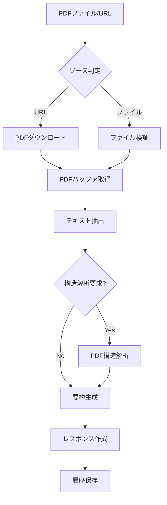

# PDF処理ロジック詳細ドキュメント

## 概要

このドキュメントでは、YouTube TranslaterアプリケーションにおけるPDF処理の仕組みについて詳しく説明します。PDFの文字起こし（テキスト抽出）、構造解析、要約生成の各プロセスを解説します。

## PDF処理フロー



## 1. PDFの文字起こし（テキスト抽出）

### 1.1 使用ライブラリ

PDF処理には`pdf-parse`ライブラリを使用しています。このライブラリは以下の特徴があります：

- PDFファイルからテキストを抽出
- メタデータ（タイトル、著者、作成日など）の取得
- ページ数、PDFバージョンなどの情報取得
- Node.js環境で動作

### 1.2 テキスト抽出プロセス

```typescript
// extractPDFText関数の実装
async function extractPDFText(pdfBuffer: Buffer): Promise<PDFContent> {
  try {
    const data = await pdfParse(pdfBuffer);
    
    // セクション分割
    const sections = extractSections(data.text);
    
    // 言語検出（最初の1000文字を使用）
    const sampleText = data.text.substring(0, 1000);
    const language = detectLanguage(sampleText);
    
    return {
      fullText: data.text,
      sections,
      pageCount: data.numpages,
      language
    };
  } catch (error) {
    throw new Error(`Failed to extract PDF text: ${error.message}`);
  }
}
```

### 1.3 セクション抽出ロジック

PDFの構造を解析し、以下のセクションを識別します：

1. **Abstract（要約）**: "abstract"という単語の後のテキスト
2. **Introduction（序論）**: "introduction"、"背景"などのキーワードで識別
3. **Methodology（方法論）**: "methodology"、"methods"、"approach"などで識別
4. **Results（結果）**: "results"、"findings"、"experiments"などで識別
5. **Conclusion（結論）**: "conclusion"、"summary"、"discussion"などで識別
6. **References（参考文献）**: "references"、"bibliography"などで識別

```typescript
function extractSections(text: string): PDFSection[] {
  const sections: PDFSection[] = [];
  const lines = text.split('\n');
  
  // セクションパターンの定義
  const sectionPatterns = {
    abstract: /^(abstract|要約|概要)/i,
    introduction: /^(introduction|はじめに|序論|背景)/i,
    methodology: /^(methodology|methods|approach|手法|方法)/i,
    results: /^(results|findings|experiments|結果|実験)/i,
    conclusion: /^(conclusion|summary|discussion|結論|まとめ)/i,
    references: /^(references|bibliography|参考文献)/i
  };
  
  // 各行をチェックしてセクションを識別
  // ...実装の詳細
  
  return sections;
}
```

## 2. PDF構造解析

### 2.1 メタデータ抽出

PDFファイルから以下のメタデータを抽出します：

- **タイトル**: PDFメタデータまたは最初の大きなテキストブロック
- **著者**: メタデータまたは"by"、"著者"などのキーワードから推定
- **発行日**: メタデータまたはテキスト内の日付パターンから抽出
- **DOI**: デジタルオブジェクト識別子のパターンマッチング
- **ジャーナル名**: 出版情報から抽出
- **キーワード**: abstractまたはkeywordsセクションから抽出

### 2.2 学術論文の特殊処理

学術論文の場合、以下の追加処理を行います：

1. **arXiv IDの抽出**: URLまたはテキストからarXiv:XXXX.XXXXXパターンを検出
2. **引用情報の解析**: 参考文献セクションの構造化
3. **図表の検出**: "Figure"、"Table"などのキャプションを識別

## 3. 要約生成プロセス

### 3.1 OpenAI APIの使用

要約生成にはOpenAI APIを使用します。以下のプロンプト戦略を採用：

```typescript
const systemPrompt = `You are an expert at analyzing and summarizing academic papers and documents. 
Provide a clear, structured summary that captures the key points, methodology, findings, and implications.
${language === 'ja' ? 'Please respond in Japanese.' : 'Please respond in English.'}`;

const userPrompt = `Please summarize the following PDF document:

Title: ${metadata.title}
Authors: ${metadata.authors?.join(', ') || 'Unknown'}
Pages: ${metadata.pageCount}

Content sections:
${pdfContent.sections.map(s => `\n[${s.type.toUpperCase()}]\n${s.content.substring(0, 1000)}...`).join('\n\n')}

Provide a comprehensive summary including:
1. Main topic and objectives
2. Key methodology or approach
3. Main findings or arguments
4. Conclusions and implications
5. Notable limitations or future work`;
```

### 3.2 トークン管理

PDFは長大なテキストを含むことが多いため、以下の戦略でトークンを管理：

1. **セクション単位の要約**: 各セクションの最初の1000文字を使用
2. **コンテキスト圧縮**: 重要なセクション（Abstract、Conclusion）を優先
3. **トークン推定**: 文字数÷4でおおよそのトークン数を推定

### 3.3 エラーハンドリング

要約生成時のエラーは以下のように処理：

```typescript
try {
  summary = await generatePDFSummary(pdfContent, metadataForSummary, gptModel, language);
} catch (summaryError) {
  console.error('Error generating PDF summary:', summaryError);
  // エラーが発生しても処理を継続
  summary = '';
  summaryCost = 0;
  
  if (summaryError instanceof OpenAIError) {
    // OpenAI APIのクォータ制限などの場合
    console.log('OpenAI API error detected, continuing without summary');
  }
}
```

## 4. コスト計算

### 4.1 トークンベースのコスト計算

```typescript
const modelPricing = pricing.models[gptModel];
const inputTokens = Math.ceil(pdfContent.fullText.length / 4);
const outputTokens = Math.ceil(summary.length / 4);
const summaryCost = (inputTokens * modelPricing.input) + (outputTokens * modelPricing.output);
```

### 4.2 料金モデル

- **入力トークン**: PDFテキストの長さに基づく
- **出力トークン**: 生成された要約の長さに基づく
- **モデル別料金**: GPT-4o、GPT-4o-mini等のモデルごとに異なる料金設定

## 5. セキュリティ考慮事項

### 5.1 ファイル検証

- **MIMEタイプチェック**: `application/pdf`のみ許可
- **ファイルサイズ制限**: 最大50MB
- **マジックナンバー検証**: PDFファイルの先頭バイトを確認（将来実装予定）

### 5.2 URL検証

PDF URLは以下の条件を満たす必要があります：

1. HTTPSプロトコル必須
2. `.pdf`拡張子または学術ドメイン（arxiv.org、.edu、doi.org）
3. リダイレクトの追跡制限

### 5.3 一時ファイルの管理

- アップロードされたファイルは処理後5分で自動削除
- エラー発生時は即座にクリーンアップ

## 6. パフォーマンス最適化

### 6.1 メモリ管理

- **ストリーミング処理**: 大きなPDFファイルに対応
- **バッファサイズ制限**: メモリ使用量の制御

### 6.2 並行処理

- テキスト抽出と構造解析は並行実行可能
- 複数のPDF処理リクエストは独立して処理

## 7. 今後の拡張計画

1. **OCR対応**: 画像ベースのPDFのテキスト抽出
2. **多言語対応**: より多くの言語での構造解析
3. **図表抽出**: グラフや表の内容理解
4. **引用解析**: 参考文献の構造化とリンク生成
5. **増分更新**: 大きなPDFの部分的な処理

## トラブルシューティング

### Q: PDFの要約が生成されない

A: 以下を確認してください：
1. OpenAI APIキーが正しく設定されているか
2. APIクォータが残っているか
3. `generateSummary`パラメータが`true`に設定されているか
4. `extractStructure`が`false`でも要約が生成されるよう修正済みか

### Q: PDFのテキストが文字化けする

A: pdf-parseライブラリはUTF-8エンコーディングを想定しています。特殊なエンコーディングのPDFは正しく処理されない可能性があります。

### Q: 処理時間が長い

A: 大きなPDFファイルの場合、以下の最適化を検討：
1. セクション単位での処理
2. 要約対象テキストの削減
3. より高速なモデル（gpt-4o-mini）の使用

---

最終更新: 2025年7月17日